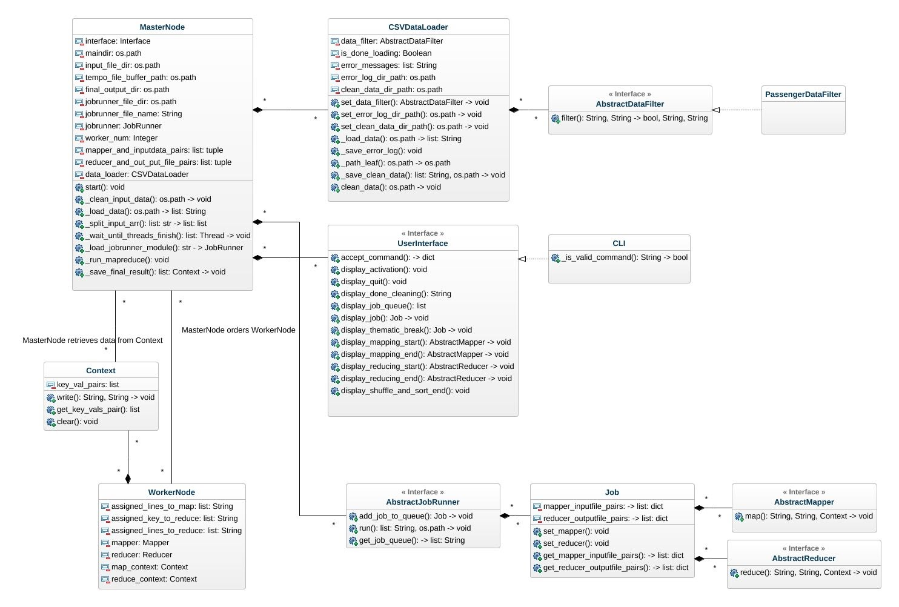

Amon Otsuki
CSMCC16-19-0V
13/12/2019

# このプログラムの目的
- このプログラムは、[MapReduce](https://jp.talend.com/resources/what-is-mapreduce/#:~:text=MapReduce%E3%81%AF%E3%80%81%E3%83%9A%E3%82%BF%E3%83%90%E3%82%A4%E3%83%88%E8%A6%8F%E6%A8%A1%E3%81%AE,%E3%82%92%E3%82%A2%E3%83%97%E3%83%AA%E3%82%B1%E3%83%BC%E3%82%B7%E3%83%A7%E3%83%B3%E3%81%AB%E8%BF%94%E3%81%97%E3%81%BE%E3%81%99%E3%80%82)という並列処理技術を勉強するために、大学の授業で製作したものです。概念は授業で勉強しましたが、設計・実装は自分で行いました。複数のテキストファイルをMapフェーズ、Shuffleフェーズ、Reduceフェーズを通して、複数のコンピュター・コアで並列化できる形式で処理するのが目的です。
プロジェクトの概要(英文)は[こちら](documents/CSMCC16_Assignment.pdf)
*PythonのThreadライブラリは単一Threadで走るため、実際に並列処理化するには別のライブラリの使用が必要です。

# 動作確認の方法
1. リポジトリをクローンする
2. Python3環境で、"python Adoop-dev.py"を実行する。* 起動しない場合は、 "python Adoop-dev.py"
3. 以下のコマンドを入力
  ```
  CLEAN AComp_Passenger_data.csv
  ```
  - → inputfiles/AComp_Passenger_data.csvをデータクリーニングして、再フォーマットする。データクリーニングのプロセスは　classes/errorhandling/CSVDataLoader.py 内に有り。クリーンデータファイルは、inputfiles内に出力される。


  ```
  RUN (1)NumberOfFlightsFromEachAirport.py AComp_Passenger_data_CLEANED.csv Top30_airports_LatLong.csv
  ```
  - → AComp_Passenger_data_CLEANED.csv Top30_airports_LatLong.csvをインプットとして、classes/mapreduce_mods/(1)NumberOfFlightsFromEachAirport.py内に書かれているMapperとReducerでインプットを処理する。このモジュールは、二つのインプットファイルから、各空港からの出発便数を出力する。アウトプットファイルは、outputfilesディレクトリに出力される。

  ```
  RUN (2)ListOfFlights.py AComp_Passenger_data_CLEANED.csv Top30_airports_LatLong.csv
  ```
  - → AComp_Passenger_data_CLEANED.csv Top30_airports_LatLong.csvをインプットとして、classes/mapreduce_mods/(2)ListOfFlights.py内に書かれているMapperとReducerでインプットを処理する。このモジュールは、二つのインプットファイルから、全フライトをIDに紐づいている情報を出力する(Passenger ID, the passenger Id, relevant IATA/FAA codes, the departure time, the arrival time, and the flight times.)。アウトプットファイルは、outputfilesディレクトリに出力される。

  ```
  RUN (3)NumberOfPassengers.py AComp_Passenger_data_CLEANED.csv Top30_airports_LatLong.csv
  ```
  - → AComp_Passenger_data_CLEANED.csv Top30_airports_LatLong.csvをインプットとして、classes/mapreduce_mods/(3)NumberOfPassengers.py内に書かれているMapperとReducerでインプットを処理する。このモジュールは、二つのインプットファイルから、各フライントの乗客数を出力する。アウトプットファイルは、outputfilesディレクトリに出力される。

  ```
  RUN (4)HighestMileage.py AComp_Passenger_data_CLEANED.csv Top30_airports_LatLong.csv
  ```
  - → AComp_Passenger_data_CLEANED.csv Top30_airports_LatLong.csvをインプットとして、classes/mapreduce_mods/(4)HighestMileage.py内に書かれているMapperとReducerで処理する。このモジュールは、各フライトの飛行距離を計算して、その結果を利用して、各乗客(passenger)の総飛行距離を出力する。アウトプットファイルは、outputfilesディレクトリに出力される。

# MapReduce Prototyping

Source code: https://github.com/Goma0925/MapReduceMimic
Executable version: https://github.com/Goma0925/MapReduceMimic_Production

## Abstract

- In this project, I created a MapReduce application prototype to better understand the function and structure of MapReduce, using the implementation of Hadoop as a reference. The goal of the prototype is to provide a feature to perform MapReduce equivalent operations and mimic the parallel computing by using threads.

## How to use the application
To begin with, please download the executable version of the prototype from https://github.com/Goma0925/MapReduceMimic_Production. In this directory, you can find an executable file called Adoop along with two input files in the “inputfiles” directory and four MapReduce files in “classes/mapreduce_mods” directory. You can start the application by typing “Adoop” in the repository.  Each of these MapReduce files contains a solution for an assignment question. The further details of implementation are discussed in Question Solutions section. Please do not delete the other directories since they serve as input and output storages and temporary file buffer of the process. To start, you can open the file named Adoop and it will display the command line interface of the application. Before running MapReduce jobs, you can clean input data by typing in:
	“CLEAN AComp_Passenger_data.csv”.

The first argument of a command specifies a mode and the second one specifies a target file. Once you execute the command, a new file called “AComp_Passenger_data_CLEANED.csv” is created that contains no errors in terms of the format. This is done by a class called CSVDataLoader mentioned in the next section. Now, this cleaned data file can be used for each MapReduce job. To run a MapReduce job, you specify a MapReduce module and input files by typing:
 	“RUN (1)NumberOfFlightsFromEachAirport.py AComp_Passenger_data_CLEANED.csv Top30_airports_LatLong.csv”

This will run a mapreduce job for the first question. Similarly, the mapreduce jobs for the other questions can be run by typing each of the following commands:
	“RUN (2)ListOfFlights.py AComp_Passenger_data_CLEANED.csv”
	“RUN (3)NumberOfPassengers.py AComp_Passenger_data_CLEANED.csv”
	“RUN (4)HighestMileage.py AComp_Passenger_data_CLEANED.csv Top30_airports_LatLong.csv”

The final output files will be created in “outputfiles” directory. The “tempobuffer” directory is used by the application to store output between chained jobs.
This application also allows you to use other input files and MapReduce modules. To add a new input file, you simply have to put it in the inputfiles directory. To add a new MapReduce module, you can copy a file named “JobRunnerTemplate.py” and implement your own MapReduce. Once you have placed it in the “classes/mapreduce_mods” directory, you can start Adoop and type in the command in the format of “RUN <MapReduce Module> <Input file 1> <Input file 2> ...”


## Architecture


- The MapReduce prototype consists of the classes shown above in the diagram. I am going to describe the general functionality and reasons for the architectural decisions in this section. Due to the page limit, please refer to the code for the specific implementation of each function.

### MasterNode class
This class is the center of the process that executes the main MapReduce jobs using the other classes. It coordinates the other supplemental classes and controls the process flow.

### WorkerNode class
- This class mimics each worker node in the actual distributed parallel MapReduce system. Each instance of the class is responsible for executing a mapper function and a reducer function using a given input and records the results using context instances mentioned below.

### Context class
- This class is responsible for bridging the information exchange between MasterNode and WorkerNode by recording the result of mapping and reducing processes. Although there is an alternative implementation where MasterNode retrieves the results directly from WorkerNode, I decided to create this class because Hadoop lets a user record key and value pairs through a context object in mapper and reducer implementations(https://hadoop.apache.org/docs/current/hadoop-mapreduce-client/hadoop-mapreduce-client-core/apidocs/org/apache/hadoop/mapreduce/Mapper.Context.html?is-external=true). This class also gives some flexibility to the implementation of the MasterNode and WorkerNode by loosely coupling them.

### CSVDataLoader
- This class composes MasterNode. MasterNode calls it to clean an input file with a target file name. Upon the call, CSVDataLoader reads the given file, create an array of each text line, and executes for loop on the array to verify each input line by using an (Abstract)DataFilter mentioned below. In the end, it will create an array with only the valid input rows and produce a cleaned data file with the same name but with a “CLEANED” signifier added at the end. The purpose of this class is to decouple the MapReduce implementation and data cleaning implementation so that I could develop them separately. It also allows me to switch to other DataLoader classes in case I need to use different formats of files in the future.

### AbstractDataFilter class - Abstract class (Interface)
- This abstract class has only one method named “filter” that takes each row of an input file and its index number, and returns a boolean flag of whether or not the row is valid, the cleaned string of the row, and a string of a message that shows the result of the “filtering”. The purpose of the class is to decouple the implementation of the CSVDataLoader from the implementation of input validation that is specific to each file structure. In this project, I only added PassengerDataFilter that is compatible with “AComp_Passenger_data.csv”, however, other data filters could be used instead to validate files with different structures.

### UserInterface class - Abstract class (Interface)
- This class functions as the bridge between the MasterNode and the (command line) interface of the application. It is responsible to accept input from a user, validate it, return it to the MaterNode, and display appropriate messages on the command line interface in each phase of the MapReduce process. This class helps me avoid coding print statements in the code of the main logic of MapReduce, which improves code readability and maintainability. The implementation of this abstract class is done in the CLI class, which stands for command-line interface. In the development phase, I also created the TestInputInterface class that provides the MasterNode with a certain set of user inputs without any user input, which allowed only the MapReduce process to run.

### AbstractJobRunner class - Abstract class (Interface)
- The abstract class is used by a user to implement their own JobRunner class in which he/she creates a MapReduce job using the Job class and add it to a job queue. It functions as a bridge between the MasterNode and a user where the user provides instructions for MapReduce processes. In the runtime, the MasterNode finds the implementation of the AbstractJobRunner that a user has provided and executes the “run” method of the implementation. Once the method is executed, the JobRunner instance holds a list of Job objects to execute, which is then passed to MasterNode to execute each MapReduce job. Note that job chaining can done using the second parameter called tempoFileBufferPath, which is a path location for a temporary file buffer, which is for a user to save an intermediate result between different jobs. For example, one job can save its output in tempoFileBufferPath, and the next job can take the output as input from a file stored in tempoFileBufferPath.

### Job
- The Job class is a container to keep track of the correspondence between the user-implemented mapper classes and their assigned input files, and the user-implemented reducer classes and their target output file names. A user can set pairs of a mapper and an input file and pairs of a reducer and its output file.

### AbstractMapper
- This abstract class is used for a user to implement his/her own mapper function.

### AbstractReducer
- This abstract class is used for a user to implement his/her own reducer function.

### Development Steps
- The development of the prototype was done in incremental steps. In the first phase, I developed the CSVDataLoader independently of other classes. Then I created a code snippet that loads modules based on a string input of a name of a python file. After that, I added the CSVDataLoader and the code snippet into the MasterNode and started developing the MapReduce feature. I first created a non-threaded MapReduce function so that I can focus on the main logic of the mapping, reducing, and shuffling phase. Once the non-threaded MapReduce was complete, I started coding the solutions for each of the assignment questions. This is when I realized having a job chaining feature would be very helpful. So I decided to add JobRunner class and Job class to allow a user to implement job chaining. Finally, as the last phase, I implemented threads to mimic the parallel computing aspect of a MapReduce system.


### MapReduce Descriptions
In this section, I will describe the details of the MapReduce process written in MasterNode.start() and MasterNode_run_mapreduce().
As the application starts, MasterNode.start() function will be executed. It first initializes the DataLoader and DataFilter, and calls the CLI to prompt a user for input. Then a user types in a string in the command-line interface, which is validated and processed by CLI.accept_command(). Based on this input, the MasterNode either executes the _clean_input_data() method to produce a cleaned data file or _run_mapreduce(). In the latter case, MasterNode retrieves the JobRunner module based on the string of the user input, executes its JobRunner.run() method, and acquire its job queue. It will then run a for loop for each job, to run the function _run_mapreduce(). In preparation for this mapreduce phase, MasterNode also retrieves the pairs of an input file and a mapper class, and the pairs of an output file name and a reducer, which would be stored as “MasterNode.mapper_and_inputdata_pairs” and “MasterNode.reducer_and_outputpath_pairs”.

The MapReduce process in MapReduce._run_mapreduce() includes the mapping phase, the shuffling and sorting phase, and the reducing phase. In the mapping phase, MasterNode splits an array of the input data into chunks according to the number of WorkerNodes. Then each of the chunk array will be fed into a worker’s mapper function. Each worker executes a mapper function and records the result of the mapper in a Context object provided by the MasterNode. In Hadoop, the following process can carry out the combining phase where keys and values are reduced locally in order to reduce the data transmission cost between distributed computers. However, considering the unnecessity of the combiner phase due to the size of the files to process in this project and the fact that some assignment questions require a different combiner class implementation than a reducer, I decided not to implement the combining phase to avoid increasing the complexity of the code.
In the shuffling phase, the Context objects from each WorkerNode in the mapping phase are collected and used for shuffling and sorting. All the key-value pairs from the mapping phase are retrieved and reformatted in the pairs of a key and an array of multiple values associated with the key. Each of these value arrays are then sorted in the sorting phase by Python built-in sorted() function.

The final reducing phase is executed for every reducer set by the JobRunner provided by a user. The MasterNode first provides all the WorkerNodes with a reducer class and runs a for loop for every key in “sorted_key_vals_pairs” from the previous phase. Then, the MasterNode provides each WorkerNode a pair of a key and an array of associated values. As it allocates keys to all the available WorkerNodes and start threads on them, it will wait until all the threads finish and restart allocating the rest of the key-value pairs to the WorkerNodes. Before it resumes to allocate the pairs, the MasterNode retrieves the copy of the reduce contexts from each WorkerNode as output. Once all the key-value array pairs are reduced, the MasterNode retrieves the reduce contexts from each WorkerNode once again, and call its “save_final_result” method to write the output in a file.

### Question Solutions
As mentioned in the usage section, the implementation of each MapReduce job is written in a python file in the classes/mapreduce_mods directory, which is located in “classes/classes/mapreduce_mods” for the source code.

- Q1) Determine the number of flights from each airport; include a list of any airports not used.

- A1) The solution for the Q1 is written in “(1)NumberOfFlightsFromEachAirport.py”.
I used the data from both the passenger data file and the airport data file, using two mappers and a reducer to process them. The PassengerDataMapper parses each row of the input into a key of a departure airport and a value in the format of “isPassengerData|<FlightID>”. Also, the AirportDataMapper parses the airport data into a pair of a departure airport code as a key and the name of the airport. Consequently, in the reducing phase, we would get a pair of a departure airport and an array that includes both flight IDs that departed from the airport and the airport name. Therefore, the Reducer1 runs a for loop for the value array and 1) extracts the flight IDs for the airport and 2) retrieves the airport name associated with the key airport code. Finally, it records the name of the airport with its airport ID as a key, and the number of flights that departed from the airport as a value.

- Q2) Create a list of flights based on the Flight id, this output should include the passenger Id, relevant IATA/FAA codes, the departure time, the arrival time (times to be converted to HH:MM:SS format), and the flight times.

- A2) The solution for Q2 is implemented in “(2)ListOfFlights.py”. This job includes just one mapper and a reducer. The PassengerDataMapper just extracts a flight ID from each row as a key and the string of the entire row as a value. Then the Reducer takes the first element from the value array and parses the pieces of information associated with the particular flight ID, such as departure and arrival airport codes, departure and arrival times, and flight time, which are also formatted in a readable string.

- Q3) Calculate the number of passengers on each flight.

- A3) The solution for the Q3 is implemented in “(3)NumberOfPassengers.py”. The PassengerMapper extracts a flight ID as a key and a passenger ID as a value from each row of input. The Reducer simply counts how many passengers are associated with each flight. Each row of the output file shows a flight ID on the left and the number of passengers on the flight.

- Q4) Calculate the line-of-sight (nautical) miles for each flight and the total traveled by each passenger and thus output the passenger having earned the highest air miles.

- A4) The solution for Q4 is implemented in “(4)HighestMileage.py”. This solution involves 4 jobs and two output files. The details of implementation for each mapper and reducer are commented in the code due to the page limit of this paper. However, each job has the following as a step toward the final output.

-  **Job1**
Put the passenger data and the airport data together to produce the output that shows each “ticket” that a passenger took with the airport information. The output is in the following output:
	<ticket_identifier(passengerID & lineIndex)>/<DEPARTURE or ARRIVAL>: <FAA_CODE>|<latitude, longitude>
	*<> denotes a variable.

- **Job2**
In the Job2 output, the departure and arrival airport information for each flight is still separate in two pieces of information. Job2 merges them and produce output that shows each flight ticket with the departure and arrival airport codes and their coordinates. Each ticket is also marked with a passenger ID.

- **Job3**
Job3 calculates the flight distance for each ticket, associates the distance to each passenger, and calculates the total distance traveled by each passenger, which finally produces a list of passengers and their traveled mileage. This job produces the output in “(4)DistanceTravelledByEachPassenger.txt”, which shows a passenger ID and his/her distance traveled in each row.

- **Job4**
Using the output of Job3, Job4 simply finds a passenger with the most distance traveled. This job produces output in “(4)HighestAirmile.txt” that only contains a passenger ID with the highest mileage and his/her total distance traveled.

### Reflection
- This MapReduce prototype includes the essential elements of MapReduce, such as mapping, shuffling, sorting, and reducing. Although this prototype lacks the capability to process a large amount of data and to parallel compute the output, it is useful in analyzing a decent size of text and CSV file and carrying out a complex processing just as the solutions for the assignment questions. In addition, the capability of the prototype to use user-implemented MapReduce files allows a user to deal with many different formats of input files. In addition, the loosely coupled implementation of MasterNode and WorkerNode has room for a possible improvement to implement a server-client system into the code to execute parallel computing among different computers. Python’s built-in socket library should help to implement such a feature. Also, CSVDataLoader could be refactored to read a certain size of a file at a time so that it prevents stack overflow in the MasterNode, which allows a user to process bigger sizes of files.
